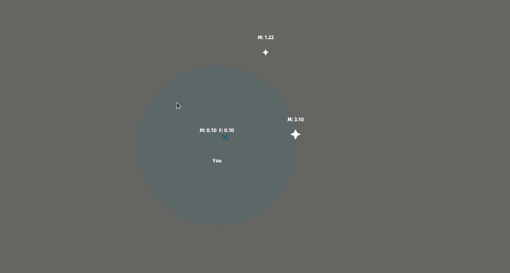
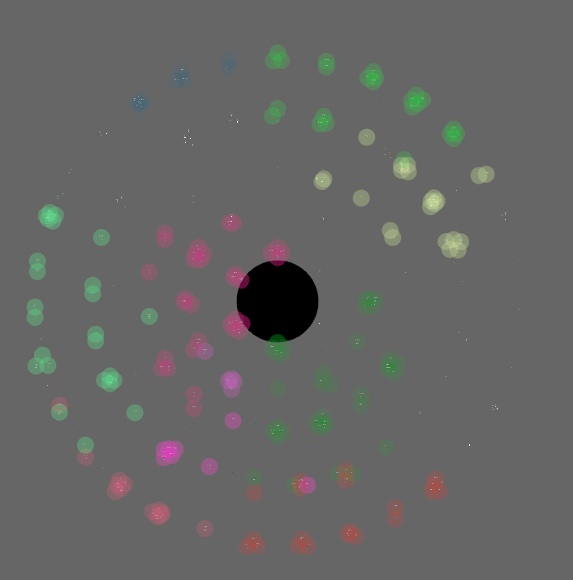
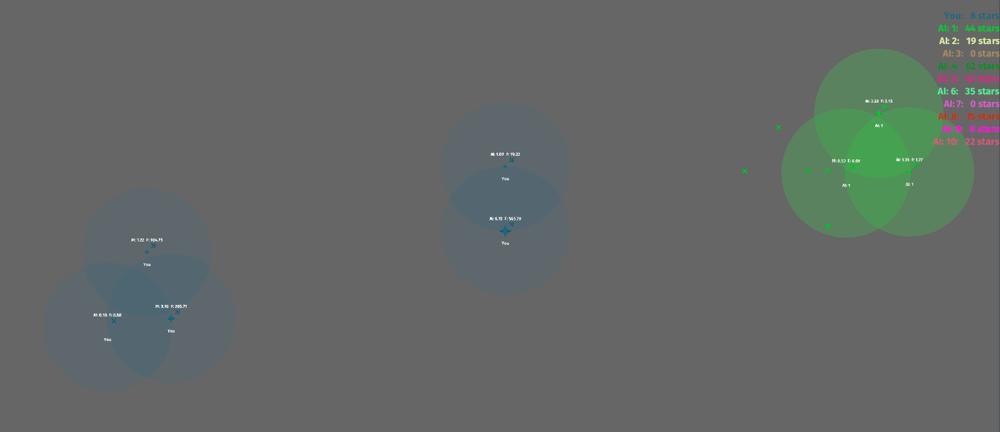
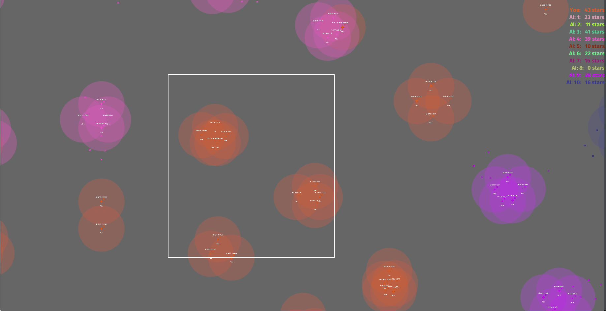
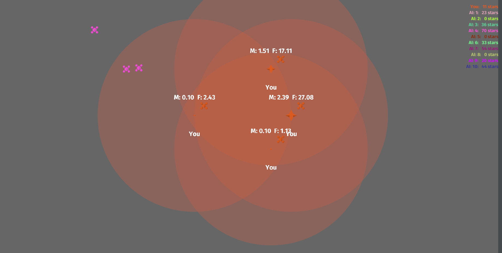

# Stars io




Game made for the Bevy Jam #1 (2022-02-25): https://itch.io/jam/bevy-jam-1

Itch.io page: https://gajop.itch.io/stars-io







# Install:

## Wasm & cargo-watch

```sh
# Install Wasm
rustup target install wasm32-unknown-unknown
# Runs our Wasm game in a browser
cargo install wasm-server-runner
# Automatically rebuilds our game on save
cargo install cargo-watch
```

# Build:

```sh
cargo run --target wasm32-unknown-unknown # Normally this binary is too large
cargo run --release --target wasm32-unknown-unknown # So we use release instead
```

# Run

Make sure you've setup .cargo/config.toml

```sh
cargo watch -cx "run --release"
```

# License

This game is dual licensed under either:

- MIT license ([LICENSE-MIT](docs/LICENSE-MIT) or http://opensource.org/licenses/MIT)
- Apache License, Version 2.0, ([LICENSE-APACHE](docs/LICENSE-APACHE) or http://www.apache.org/licenses/LICENSE-2.0)
at your option.

at your option.

Unless you explicitly state otherwise, any contribution intentionally submitted for inclusion in the work by you, as defined in the Apache-2.0 license, shall be dual licensed as above, without any additional terms or conditions.
